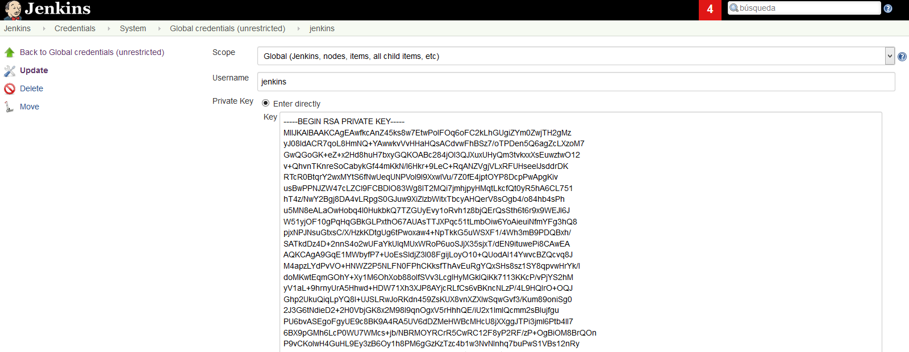
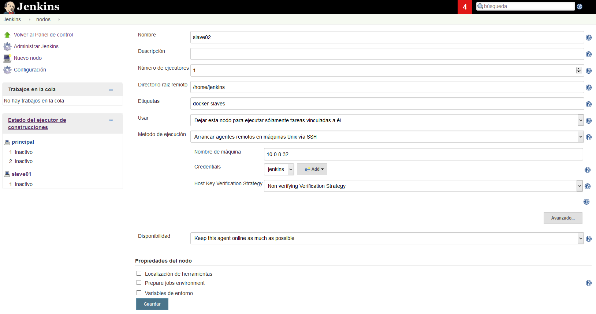
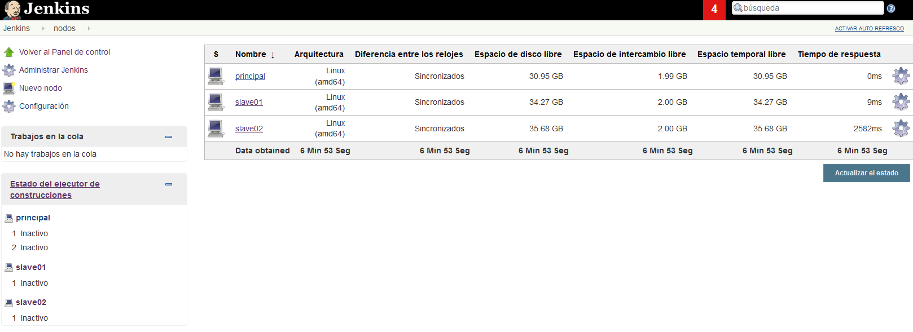

# SparkPremer-BDE Sandbox

Proyecto para aprovisionar un servidor de pruebas que ejecute un Jenkins sobre Docker.

A continuación se pueden encontrar las instrucciones sobre como configurar y ejecutar el sandbox usando Virtualbox y [Vagrant](http://vagrantup.com).

El objetivo del proyecto es contar con un entorno de pruebas automatizado lo más parecido al entorno de producción, desde el cual se puedan hacer pruebas tanto del entorno de ejecución como sobre la instalación de Jenkins, de forma controlada y realista.

También se busca disponer de un entorno, en el que los usuarios que mantengan la librería de compilación, puedan hacerlo de forma cómoda y sin necesidad de complejos procesos de instalación y configuración para contar con las herramientas de desarrollo.

## Creando el Sandbox

Lo primero que tenemos que hacer es clonar este repositório.

```
 $ git clone [REPO_URL]
```

Entramos a la carpeta del repositorio e inicializamos los submódulos de Git.

```
 $ git submodule init
 $ git submodule update
```

## Configuramos el Entorno

Creamos el fichero ```config```. Podemos hacerlo copiando el fichero de template que acompaña al proyecto.

```
 $ cp config.json.template config.json
```

Una vez que hemos creado nuestro fichero podemos llevar a cabo la configuración de nuestro servidor.

A continuación se pueden ver las principales opciones de configuración disponibles.

### Configuración General

```
"bde-master": {
    "enabled": true,
    "guest-hostname": "bde-master.vm.server",
    "group": "PREMER-BDE Sandbox",
    "box": "bento/centos-7.2",
    "timezone": "Europe/Madrid",
    "cpus": 1,
    "memory": 2048,
    "ssh-prv-key": "~/.ssh/id_rsa",
    "ssh-pub-key": "~/.ssh/id_rsa.pub",
    "network": {
      "interfaces": [
        {
          "network-type": "private",
          "if-adapter": "eth1",
          "if-inet-type": "static",
          "if-address": "10.0.9.20",
          "if-netmask": "255.255.0.0"
        }
      ]
    },
    "scripts": [
        "bootstrap.sh",
        "ssh.sh",
        "java.sh",
        "bde.sh"
    ]
},
```

| Parámetro             |  Valor(es)                                                        |
| --------------------- | ----------------------------------------------------------------- |
| `enabled`             | `true` si queremos que Vagrant cree la instancia, en caso contrario ignora el bloque de configuración. Esto se usa sobre todo cuando aprovisionamos más de una máquina desde el mismo repositorio         |
| `guest-hostname`      | Hostname de la instancia                                          |
| `group`               | Si queremos agrupar las instancias. En VirtualBox esta opción se traduce en que las máquinas virtuales que tengan este label se agruparan juntas |
| `box`                 | Vagrant Box                                                       |
| `timezone`            | Server timezone                                                   |
| `cpus`                | Número de CPUs de la instancia                                    |
| `memory`              | Cantidad de memoria de la instancia                              |
| `ssh-prv-key`         | Clave privada para acceder a la instancia. Si no indicamos nada, Vagrant intenta inyectar una clave por defecto                         |
| `ssh-pub-key`         | Clave pública para acceder a la instancia. Si no indicamos nada, Vagrant intenta inyectar una clave por defecto                         |
| `scripts`             | Listado de scripts que queremos utilizar en la etapa de provisioning  |

### Configuración de Red

A continuación se muestran los parámetros más habituales para la configuración de red.

```
"network": {
  "interfaces": [
    {
      "network-type": "private",
      "if-adapter": "eth1",
      "if-inet-type": "static",
      "if-address": "10.0.8.20",
      "if-netmask": "255.255.0.0"
    }
  ]
},
```

| Parámetro             |  Valor(es)                                                        |
| --------------------- | ----------------------------------------------------------------- |
| `network-type`        | `Private` ó `Public` [Vagrant documentation](https://www.vagrantup.com/docs/getting-started/networking.html) |
| `if-adapter`          | El nombre del adaptador de red, p.e. eth0, eth1, etc.    |
| `if-inet-type`        | `static` ó nada. [Vagrant documentation](https://www.vagrantup.com/docs/getting-started/networking.html) |
| `if-address`          | Dirección ip que queremos asignar a la interfaz                   |
| `if-netmask`          | Mascara de red                                                    |
| `bridge-adapter`      | Modo de configuración de la interfaz. [Vagrant documentation](https://www.vagrantup.com/docs/networking/public_network.html)    |

## Arrancando la Instancia

Una vez que tenemos el entorno configurado, podemos ejecutar la instancia ejecutando el siguiente comando:

```
 $ vagrant up
```

## Administrando la Instancia

A continuación se muestran los comandos más típicos necesarios para la gestión de las instancias.

| Comando                              |  Descripción                                      |
| ------------------------------------ | ------------------------------------------------- |
| `$ vagrant status`                   | Ver el estado de la instancia                     |
| `$ vagrant ssh [instance-id]`        | Conectarse a la instancia via SSH                 |
| `$ vagrant suspend [instance-id]`    | Suspender la instancia                            |
| `$ vagrant halt [instance-id]`       | Parar la instancia                                |
| `$ vagrant destroy [instance-id]`    | Destruir la instancia                             |

## Configuración Base de Jenkins

A continuación se muestras las configuraciones típicas a realizar en nuestro servidor de Jenkins.

### Registrar un Nuevo Slave

Vamos a ver como configurar un nuevo slave en nuestro servidor Jenkins. En nuestro caso, la comunicación va a hacerse via SSH.

#### Configuración de las Credenciales de Acceso

Para poder conectarnos a cada uno de los slaves, antes de nada, es necesario configurar unas credenciales de acceso. Para hacer esto entramos en la interfaz de Jenkins y nos movemos a `Jenkins` `>` `Credentials` `>` `System` `>` `Global credentials`.

Una vez ahí hacemos click en la opción `Add Credentials`.

Seleccionamos la opción `SSH Username with private key`. A continuación se nos mostrará un formulario donde podremos introducir los datos de las nuevas credenciales.

| Parámetro      |  Valor                                                          |
| ---------------| --------------------------------------------------------------- |
| `Scope`        | Global (Jenkins, nodes, items, all child items, etc)            |
| `Username`     | jenkins                                                         |
| `Private Key`  | `Enter directly`                                                |
| `Key`          | Clave privada                                                   |

A continuación se muestra una imagen donde se ilustra el resultado final de la configuración.



Por comodidad, y con el objetivo de configurar un entorno de pruebas, se adjunta en este repositorio una clave pública y privada para el acceso ssh. Esta misma clave ha sido preinyectada en los servidores slave, con lo que solamente debemos pegarla en el formulario  anterior y todo debería de funcionar sin más problemas.

Las clasves se encuentran en el directorio `files/keys/id_rsa`.

Es importante destacar que estas claves __NO__ se deben de utilizar para configuración en producción ya que, como se almacenan en un repositorio de código fuente de acceso público, están altamente comprometidas.

#### Registro de un Nuevo Slave

Una vez que tenemos disponibles las claves, es momento de dar de alta un nuevo slave.

A través de la interfaz web de Jenkins nos movemos a la opción `Manage Jenkis` `>` `Manage Nodes` y ahí hacemos click en la opción `New node`.

Ahí se nos pedirá que especifiquemos el nombre del nodo y el tipo de Agente. En el campo nombre tendremos que poner una cadena de caracteres que identifique el nodo que queremos dar de alta. En tipo de agente, seleccionamos `Permanent Agent`.

Pulsamos `OK` y se nos mostrará un formulario para que indiquemos los datos del nuevo slave. Aquí especificamos (al menos) los siguientes datos:

| Parámetro                 |  Valor                                                                 |
| ------------------------- | ---------------------------------------------------------------------- |
| `Nombre`                  | Nombre del slave. Se precarga con el valor indicado en el paso previo  |
| `Descripción`             | Descripción del slave                                                  |
| `Númer de ejecutores`     | Número de ejecutores concurrentes sobre el slave                       |
| `Directorio raiz remoto`  | `/home/jenkins`                                                        |
| `Etiquetas`               | Este campo es muy importante ya que usaremos estas etiquetas para indicar a los pipelines, en qué slaves si y en qué slaves no se pueden ejecutar. Podemos indicar una colección de cadenas de caracteres, en nuestro caso pondremos un único label con el valor `docker-slaves`|
| `Usar`                    | `Utilizar este nodo tanto como sea posible`                            |
| `Metodo de ejecución`     | `Arrancar agentes remotos en máquinas Unix vía SSH` Con esta opción indicamos que la conexión será mediante SSH. En este puto es donde usaremos las credenciales que hemos creado en el paso previo  |
| `Disponibilidad`          | `Keep this agent online ad much as possible`                           |

A continuación se muestra una imagen donde se ilustra el resultado final de la configuración.



Cuando tengamos todo listo hacemos click en el botón `Guardar`. Jenkins tarda un poco en registrar el nuevo slave.

Pasado un tiempo debería de aparecer nuestro nuevo slave listo para ser utilizado.

A continuación se muestra un ejemplo donde se pueden ver la pinta que tienen varios slaves configurados.


